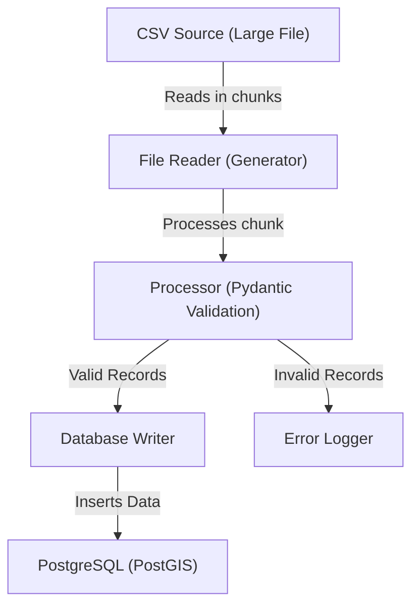

# Install Python and tools

`curl -LsSf https://astral.sh/uv/install.sh | sh`

`uv python install 3.13`

# Docker

`docker-compose up -d`

Postgis is available at `localhost:5432`.
This version doesn't run on ARM64 natively but it's OK for our purposes.

# Dataset

We are going to use a dataset from NYPD on Motor Vehicle Crashes:
https://data.cityofnewyork.us/Public-Safety/Motor-Vehicle-Collisions-Crashes/h9gi-nx95/about_data

It would be a good choice for us for the following reasons:
 - real world dataset
 - data is not expected to be clean
 - relatively large volume: over 2,1M records
 - time series data
 - contains geo location data
 - CSV file size is 455 MB

## CSV Processing Pipeline

