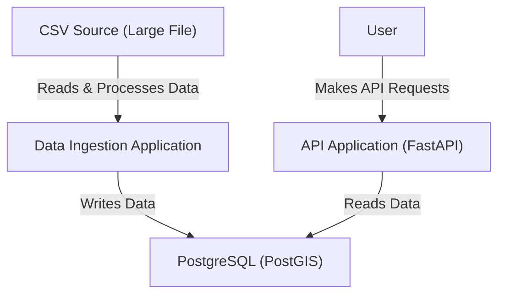
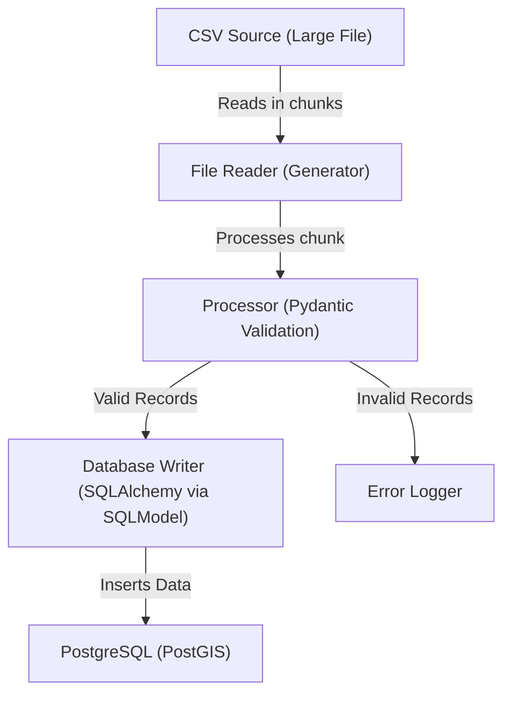

# Install
## Python and tools


- `curl -LsSf https://astral.sh/uv/install.sh | sh`
- `uv python install 3.13`
- `uv install`

## Docker

`docker-compose up -d`

Postgis is available at `localhost:5432`.
This version doesn't run on ARM64 natively but it's OK for our purposes.

# Dataset

We are going to use a dataset from NYPD on Motor Vehicle Crashes:
https://data.cityofnewyork.us/Public-Safety/Motor-Vehicle-Collisions-Crashes/h9gi-nx95/about_data

It would be a good choice for us for the following reasons:
 - real world dataset
 - data is not expected to be clean
 - relatively large volume: over 2,1M records
 - time series data
 - contains geo location data
 - CSV file size is 455 MB

# Run

Data ingestion app:
`uv run python src/ingest.py`

API:
`uv run uvicorn src.api:app --reload`

# Diagrams

## High level diagram



## CSV Processing Pipeline



# Decisions and thought process

I decided to build the application on top of PostgreSQL, a very popular database system with strong community support and a rich ecosystem.
For a truly time-series dataset, I would choose a more specialized database like ClickHouse or Apache Druid. However, for our dataset, PostgreSQL is more than sufficient.
Since we have geolocation data, I used the PostGIS extension, which provides native support for spatial data.

I’ve created a Docker Compose file that pulls the PostGIS image, sets up the schema and table, and creates indexes.
In a production environment, I would use a database migration tool to manage schema changes instead of defining them in a script.
I would also opt for a managed cloud solution for PostgreSQL, such as Amazon Aurora, for scalability and maintenance.

For the data ingestion app, I chose a modular structure instead of implementing everything in a single function:
	•	file_reader contains a Python generator that reads file chunks efficiently without consuming too much memory. It automatically processes the most recently modified CSV file in the data directory.
	•	processor leverages the battle-tested Pydantic library for data validation and serialization. It transforms CSV rows into structured objects.
As an additional challenge, I consolidated the crash_date and crash_time fields into a single crash_datetime field for easier querying.
I also converted latitude and longitude into PostGIS POINT geometry objects.
	•	db_writer inserts these objects into the database. If some records fail, they won’t cause the entire batch to fail, ensuring robustness.

With this approach, we could later support real-time data ingestion via an API by reusing the processor and db_writer components.

For the query API, I used FastAPI, a popular framework for building high-performance APIs.
We reuse the existing database model, with the additional step of transforming PostGIS geometry data into GeoJSON format for API responses.

There are two simple API endpoints:

- Get collision by ID. Example:


`http://127.0.0.1:8000/collisions/4456314`
```json
{
    "cross_street_name": "",
    "number_of_motorist_killed": 0,
    "vehicle_type_code3": "",
    "crash_datetime": "2021-09-11T09:35:00Z",
    "number_of_persons_injured": 0,
    "contributing_factor_vehicle_1": "Unspecified",
    "vehicle_type_code4": "",
    "borough": "BROOKLYN",
    "number_of_persons_killed": 0,
    "contributing_factor_vehicle_2": "",
    "contributing_factor_vehicle_3": "",
    "zip_code": "11208",
    "number_of_pedestrians_injured": 0,
    "vehicle_type_code5": "",
    "number_of_pedestrians_killed": 0,
    "contributing_factor_vehicle_4": "",
    "location": {
        "type": "Point",
        "coordinates": [
            -73.8665,
            40.667202
        ]
    },
    "number_of_cyclist_injured": 0,
    "contributing_factor_vehicle_5": "",
    "on_street_name": "",
    "number_of_cyclist_killed": 0,
    "vehicle_type_code1": "Sedan",
    "collision_id": 4456314,
    "off_street_name": "1211      LORING AVENUE",
    "number_of_motorist_injured": 0,
    "vehicle_type_code2": ""
}
```

- Search collisions. Supports search per borough, pagination, sorting, and some other parameters. For example:

`http://127.0.0.1:8000/collisions/?borough=Brooklyn&limit=2&page=10&injuries_min=5&injuries_max=7&sort_by=crash_datetime&order=asc`

```json
[
    {
        "collision_id": 182761,
        "off_street_name": "",
        "number_of_motorist_injured": 5,
        "vehicle_type_code2": "PASSENGER VEHICLE",
        "cross_street_name": "BUFFALO AVENUE                  ",
        "number_of_motorist_killed": 0,
        "vehicle_type_code3": "",
        "crash_datetime": "2012-08-04T10:50:00Z",
        "number_of_persons_injured": 5,
        "contributing_factor_vehicle_1": "Outside Car Distraction",
        "vehicle_type_code4": "",
        "borough": "BROOKLYN",
        "number_of_persons_killed": 0,
        "contributing_factor_vehicle_2": "Unspecified",
        "contributing_factor_vehicle_3": "",
        "zip_code": "11233",
        "number_of_pedestrians_injured": 0,
        "vehicle_type_code5": "",
        "number_of_pedestrians_killed": 0,
        "contributing_factor_vehicle_4": "",
        "location": {
            "type": "Point",
            "coordinates": [
                -73.9247844,
                40.6771023
            ]
        },
        "number_of_cyclist_injured": 0,
        "contributing_factor_vehicle_5": "",
        "on_street_name": "ATLANTIC AVENUE                 ",
        "number_of_cyclist_killed": 0,
        "vehicle_type_code1": "OTHER"
    },
    {
        "collision_id": 116505,
        "off_street_name": "",
        "number_of_motorist_injured": 5,
        "vehicle_type_code2": "PASSENGER VEHICLE",
        "cross_street_name": "BATCHELDER STREET               ",
        "number_of_motorist_killed": 0,
        "vehicle_type_code3": "",
        "crash_datetime": "2012-08-04T22:30:00Z",
        "number_of_persons_injured": 5,
        "contributing_factor_vehicle_1": "Failure to Yield Right-of-Way",
        "vehicle_type_code4": "",
        "borough": "BROOKLYN",
        "number_of_persons_killed": 0,
        "contributing_factor_vehicle_2": "Unspecified",
        "contributing_factor_vehicle_3": "",
        "zip_code": "11229",
        "number_of_pedestrians_injured": 0,
        "vehicle_type_code5": "",
        "number_of_pedestrians_killed": 0,
        "contributing_factor_vehicle_4": "",
        "location": {
            "type": "Point",
            "coordinates": [
                -73.9381878,
                40.5962324
            ]
        },
        "number_of_cyclist_injured": 0,
        "contributing_factor_vehicle_5": "",
        "on_street_name": "AVENUE W                        ",
        "number_of_cyclist_killed": 0,
        "vehicle_type_code1": "PASSENGER VEHICLE"
    }
]
```

The biggest challenge was setting up everything from scratch—handling database connections, configurations, and boilerplate code.
I wouldn’t say it was complicated, but it was more time-consuming compared to implementing the actual logic.
I ended up spending more time than initially planned, but I genuinely enjoyed the process.

The entire ingestion took about 25 minutes on my machine, which I believe can be improved.
I would explore switching the ingestion app to async mode and experimenting with multi-threading to speed it up.
